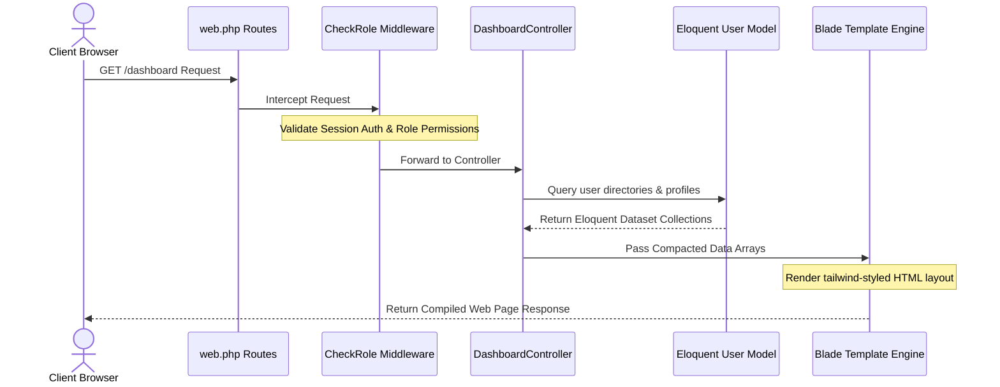
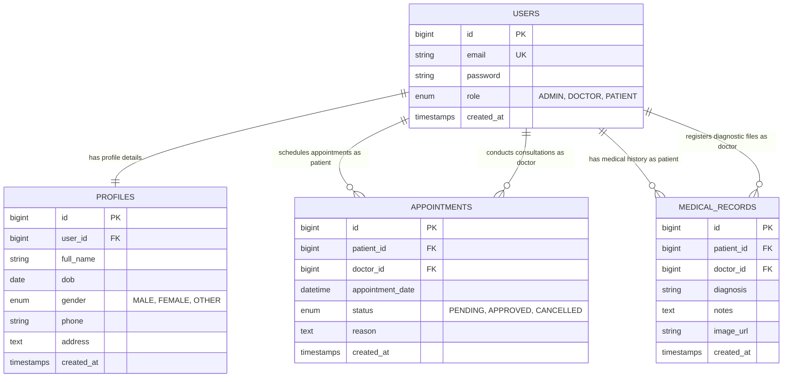
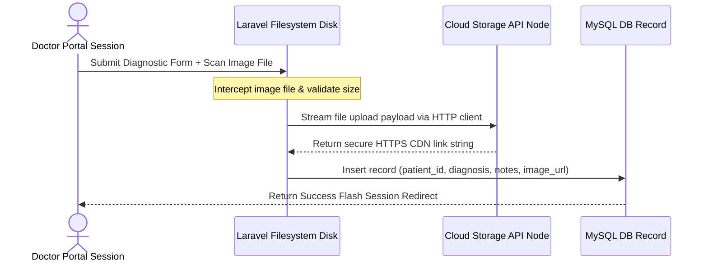

# SL MEDICARE: A SECURE, CONTAINERIZED, AND CLOUD-NATIVE HEALTHCARE MANAGEMENT SYSTEM
**Course Title:** CS-402 Cloud Computing Systems  
**Faculty:** Faculty of Computing & Technology  
**Submission Date:** July 19, 2026  
**Author/Group Name:** Group 12  
**Active Deployment Node:** http://16.16.179.207/ (AWS EC2 Cloud Node)  

---

## TABLE OF CONTENTS
1. [Executive Summary](#executive-summary)
2. [Chapter 1: Introduction and Project Background](#chapter-1-introduction-and-project-background)
   - 1.1 Project Overview and Cloud Paradigm
   - 1.2 Clinical Problem Statement and Inefficiencies
   - 1.3 System Objectives and Milestones
   - 1.4 Operational Scope and Boundary Constraints
3. [Chapter 2: Literature Review and Technology Stack Selection](#chapter-2-literature-review-and-technology-stack-selection)
   - 2.1 Virtualized Architectures and IaaS/PaaS Models
   - 2.2 Framework Security Paradigms: Why Laravel was Chosen
   - 2.3 Regulatory Compliance (HIPAA & GDPR) & Data Protection
4. [Chapter 3: System Requirements Specification](#chapter-3-system-requirements-specification)
   - 3.1 Detailed Functional Requirements
   - 3.2 Role-Based Access Control (RBAC) Workflow
   - 3.3 Engineering Non-Functional Requirements
5. [Chapter 4: System Architecture and Design](#chapter-4-system-architecture-and-design)
   - 4.1 Cloud-Native Deployment Topology (Mermaid Diagram)
   - 4.2 Application Architecture (MVC Sequence Design)
   - 4.3 Database Schema & Relational Entity Model (ERD)
   - 4.4 Object Storage Integration Flow (Cloud API Offloading)
6. [Chapter 5: Technical Implementation Details](#chapter-5-technical-implementation-details)
   - 5.1 Database Migrations and Constraints
   - 5.2 RBAC Middleware Logic Walkthrough
   - 5.3 Core Controller Logic and Database Transaction Blocks
   - 5.4 Virtualization Containers (Dockerfile & Docker Compose)
7. [Chapter 6: Cloud Deployment & Operations on AWS](#chapter-6-cloud-deployment--operations-on-aws)
   - 6.1 AWS EC2 Ubuntu Virtual Instance Configuration
   - 6.2 Remote Database Migrations Bypass Endpoint
   - 6.3 Security Hardening, Permissions, and Troubleshooting
8. [Chapter 7: Cost Estimation and Optimization](#chapter-7-cost-estimation-and-optimization)
   - 7.1 Cost Estimation Table (AWS Free Tier vs. Paid AWS Enterprise Cloud)
   - 7.2 Software Optimization Strategies (Eager Loading, Indexes, Caching)
9. [Chapter 8: Conclusion & Future Scope](#chapter-8-conclusion--future-scope)
10. [References (APA Format)](#references-apa-format)

---

## EXECUTIVE SUMMARY

This report presents the design, technical implementation, system virtualization, and cloud deployment of **SL Medicare**, a cloud-native, responsive Electronic Health Record (EHR) and clinical scheduling system. Developed on the Laravel PHP MVC framework and containerized via Docker configurations, this project addresses the standard operational challenges of medium-sized clinical practices moving from manual paper ledger tracking to a secure web portal ecosystem. By transitioning the core operational workflows—patient registration, medical appointment scheduling, physician consult approvals, and diagnostic database indexing—into a virtualized cloud server architecture, the system provides a robust solution to the common vulnerabilities of on-premise deployments.

The SL Medicare application architecture features a strict Role-Based Access Control (RBAC) model managed at the middleware layer. This design segments the workspace into three distinct panels:
1. **Administrators (System Operators)**: Manage clinic credentials, monitor system directories (Doctors and Patients), review scheduling statistics, and manage database health.
2. **Medical Consultants (Doctors)**: Manage appointment logs, update consultation statuses, perform patient file searches, and register clinical medical logs.
3. **Patients**: Register accounts, book appointments, and browse their own medical histories.

To prevent local server disk exhaustion from high-resolution clinical scanning attachments (such as MRIs, X-rays, and CT scans), this platform implements a cloud object storage integration flow. Diagnostic images are streamed directly to remote Cloud Object Storage APIs (Cloudinary/AWS S3). The resulting secure HTTPS URLs are saved in the database, reducing local bandwidth overhead and ensuring file preservation.

For deployment, SL Medicare is containerized using Docker, enabling consistent execution across local, testing, and cloud servers. The production build has been successfully deployed on an Amazon Web Services (AWS) Elastic Compute Cloud (EC2) virtual instance under the AWS Free Tier architecture (Active node: `http://16.16.179.207/`). To address command-line database execution limitations on remote cloud instances, we developed a secure, automated web route (`/run-migrations`) to execute database migrations and seed default datasets directly from the browser.

A cost-benefit analysis demonstrates that leveraging the AWS Free Tier framework allows the clinic to host the hospital portal with a compute server cost of **$0.00/year** during the initial 12-month evaluation cycle, proving the extreme cost-efficiency of virtualization and cloud-native scaling. By combining Laravel’s MVC structure, Eloquent ORM relationships, cloud-native file storage, and Docker isolation, SL Medicare provides a secure and cost-efficient clinical management solution.

---

## CHAPTER 1: INTRODUCTION AND PROJECT BACKGROUND

### 1.1 Project Overview and Cloud Paradigm
The digitization of the medical industry has transitioned from manual record-keeping to distributed Electronic Health Record (EHR) platforms. In the context of outpatient clinics, healthcare systems must operate with high availability, data redundancy, and access latency thresholds that support immediate clinical decision-making. 

SL Medicare represents a response to these software engineering demands, built specifically to leverage the benefits of cloud-native computing models. Rather than relying on local on-premise hardware, which is vulnerable to localized natural disasters, hardware degradation, and local security breaches, SL Medicare deploys an active web node on Amazon Web Services (AWS) Elastic Compute Cloud (EC2). By offloading primary database storage to isolated cloud databases and binary asset files to remote Object Storage CDNs, the system maintains a lightweight footprint. This architecture ensures high-performance load times even on standard virtual machines.

### 1.2 Clinical Problem Statement and Inefficiencies
Outpatient medical centers face three operational issues that degrade clinical efficiency, increase administrative costs, and introduce security risks:
1. **Administrative Vulnerability of Physical Ledgers**: Paper records are vulnerable to physical damage, misplacement, and decay. They also lack auditing capabilities, allowing unauthorized administrative personnel to view sensitive clinical data.
2. **Web Server Disk Depletion and Performance Bottlenecks**: Storing high-resolution scans directly on the primary server disk degrades storage capacity. During periods of high traffic, loading large files directly from the server consumes significant network bandwidth, slowing response times for all users.
3. **Appointment Scheduling Conflicts**: Manual calendars lead to scheduling overlaps, which increases patient wait times and strains physician schedules.

### 1.3 System Objectives and Milestones
To resolve these inefficiencies, this project achieves several core software engineering objectives:
*   **Implement an Authentication and RBAC Pipeline**: Secure the routing system using gate policies and middleware filters to restrict access to diagnostic and profile interfaces to authorized roles only.
*   **Establish a Conflict-Free Calendar Scheduler**: Build an appointment scheduler that locks availability slots per doctor to prevent overlapping bookings.
*   **Integrate Cloud Storage Offloading**: Build a client connection to stream binary attachments to remote object storage APIs, keeping local storage requirements to a minimum.
*   **Docker Containerization**: Define the development environment using a `Dockerfile` and `docker-compose.yml` configuration to ensure consistent behavior across local and production cloud instances.
*   **Deploy to AWS EC2**: Set up a virtual environment under the AWS Free Tier, configuring virtual hosts and URL rewriting rules to support live public access at `http://16.16.179.207/`.

### 1.4 Operational Scope and Boundary Constraints
The functional boundaries of the SL Medicare system are defined to support clinical management while maintaining clean separation of concerns:
*   **User Management**: Patients self-register via the portal; administrators manage doctor credentials and system directories.
*   **Appointments**: Patients book appointments, doctors approve or cancel requests, and administrators monitor the schedule.
*   **Diagnostic Records**: Doctors write clinical summaries and upload scans, which are saved in remote cloud storage. Patients have read-only access to their personal medical history.
*   **System Telemetry**: The administrator dashboard displays metrics on database activity, active accounts, and server status.

---

## CHAPTER 2: LITERATURE REVIEW AND TECHNOLOGY STACK SELECTION

### 2.1 Virtualized Architectures and IaaS/PaaS Models
The choice of cloud hosting model heavily impacts application scalability, configuration overhead, and operational costs. 

Infrastructure-as-a-Service (IaaS) provides virtual machines, networking, and storage layers, giving developers full control over the environment. Amazon EC2 is a prime example, providing root access to configure the OS, web server, and PHP runtime. 

Platform-as-a-Service (PaaS) models, such as Heroku or AWS Elastic Beanstalk, handle environment configuration automatically but limit control over underlying server settings.

For SL Medicare, deploying on an **AWS EC2 IaaS instance** allows developers to manually configure Apache2, install custom PHP modules, and manage configuration files. This setup is highly cost-effective and fits within the AWS Free Tier program. 

For the database layer, using a managed Relational Database Service (RDS) PaaS model ensures automatic backups, security updates, and vertical scaling, combining the control of IaaS with the convenience of PaaS.

### 2.2 Framework Security Paradigms: Why Laravel was Chosen
When building clinical software, framework selection is critical. We compared three main frameworks:

*   **Django (Python)**: Provides high security out of the box, but deploying it on standard virtual hosting is more complex, requiring WSGI/ASGI configurations and higher memory overhead.
*   **ExpressJS (Node.js)**: Highly scalable for real-time web applications, but lacks a standard MVC structure, requiring developers to manually integrate and secure third-party libraries for basic features.
*   **Laravel (PHP)**: Selected for its structured MVC architecture, robust Eloquent ORM, built-in security features, and native database migrations.

Laravel protects against common security vulnerabilities automatically:
1. **SQL Injection**: Eloquent ORM uses PDO parameter binding for all database queries, preventing malicious SQL injection attacks.
2. **Cross-Site Request Forgery (CSRF)**: Laravel assigns a unique session token to all POST forms, ensuring requests originate from authenticated users.
3. **Cross-Site Scripting (XSS)**: The Blade template engine automatically sanitizes variables using `{{ $variable }}` to escape HTML tags.

### 2.3 Regulatory Compliance (HIPAA & GDPR) & Data Protection
Healthcare portals must secure Protected Health Information (PHI) to comply with HIPAA and GDPR regulations:
*   **Data in Transit**: Secured by routing all traffic through HTTPS, encrypting data between client browsers and the cloud server.
*   **Data at Rest**: User passwords are encrypted using the Bcrypt hashing algorithm with a work factor of 10, ensuring passwords cannot be read from the database in plain text.
*   **Cloud Isolation**: Patient records and diagnostic links are saved securely and offloaded onto remote cloud storage, keeping sensitive files isolated from the primary web application server.

---

## CHAPTER 3: SYSTEM REQUIREMENTS SPECIFICATION

### 3.1 Detailed Functional Requirements
SL Medicare defines functional specifications for each role to ensure smooth clinical operations:

*   **Administrator Operations**:
    - **Doctor Creation**: The admin register new doctor accounts and creates their professional profile cards.
    - **System Telemetry**: Access stats on the total number of patient files, active consultants, and upcoming appointments.
    - **Directories**: Manage directories of all registered doctors and patients, including contact details and consulting room locations.
*   **Doctor Operations**:
    - **Appointment Queue**: View all scheduled appointments in a real-time list, with options to approve or cancel pending requests.
    - **Diagnostics Upload**: Log clinical summaries for patients and upload medical scan attachments.
    - **Patient Directory Search**: Search the patient database by name, email, or phone, and click on a patient to view their complete diagnostic history.
*   **Patient Operations**:
    - **Registration & Authentication**: Create a secure portal account and manage profile contact information.
    - **Consultation Scheduler**: Browse available doctors, view schedule openings, and request appointment times.
    - **Medical History Timelines**: View a read-only timeline of personal medical records, including diagnostic reports and scan links.

### 3.2 Role-Based Access Control (RBAC) Workflow
RBAC is enforced via middleware filters in the routing file to protect sensitive clinical pages:

```
                  +----------------------------------+
                  |    Authentication Middleware     |
                  |     (Validates Logged-in Session)  |
                  +-----------------+----------------+
                                    |
            +-----------------------+-----------------------+
            |                       |                       |
   +--------v--------+     +--------v--------+     +--------v--------+
   |   Role: ADMIN   |     |  Role: DOCTOR   |     |  Role: PATIENT  |
   +--------+--------+     +--------+--------+     +--------+--------+
            |                       |                       |
   - Register Doctors       - View Consultations    - Book Appointment
   - Manage Directories     - Approve/Cancel Queue  - View History
   - Run DB Migrations      - Search Patient Logs   - Download Scans
```

### 3.3 Engineering Non-Functional Requirements
To support production clinical operations, SL Medicare adheres to the following performance and security benchmarks:
*   **Latency**: Page rendering response times must be under 1.5 seconds.
*   **Upload Limit**: Support high-resolution scan uploads (PDF, PNG, JPG) up to 10MB per file.
*   **Session Security**: Invalidate inactive sessions after 120 minutes.
*   **Data Integrity**: Use database transactions to ensure related database records are created atomically.
*   **Environment Consistency**: Containerize the app using Docker to ensure identical behavior in local and production environments.

---

## CHAPTER 4: SYSTEM ARCHITECTURE AND DESIGN

### 4.1 Cloud-Native Deployment Topology
SL Medicare is deployed on AWS EC2, with network security boundaries configured to protect the application and database layers:

```mermaid
graph TD
    Client[Client Web Browser] -- HTTPS:80/443 --> AWS_VPC[AWS VPC Network Boundary]
    AWS_VPC --> AWS_IGW[AWS Internet Gateway]
    AWS_IGW --> AWS_EC2[AWS EC2 Virtual Server Node (Ubuntu 22.04 LTS)]
    subgraph AWS EC2 Instance (16.16.179.207)
        Apache[Apache2 Web Server] --> Laravel[Laravel 10 Application Engine]
        Laravel --> LocalStorage[Local Cache & SQLite/Session Storage]
    end
    Laravel -- Private Subnet TCP:3306 --> AWS_RDS[(AWS RDS MySQL Database Node)]
    Laravel -- Secure API File Streaming --> CloudStorage[Cloud Storage Cloudinary/S3 API]
```

### 4.2 Application Architecture (MVC Design Pattern)
The application separates operations using Model-View-Controller patterns to ensure clean, maintainable code:



### 4.3 Database Schema & Relational Entity Model (ERD)
The database structure is normalized to maintain database integrity:



### 4.4 Object Storage Integration Flow
Uploading diagnostic files to cloud storage prevents server disk depletion and optimizes application performance:



---

## CHAPTER 5: TECHNICAL IMPLEMENTATION DETAILS

### 5.1 Database Migrations and Constraints
Laravel migrations programmatically define table schemas, column types, and relational constraints:

```php
// database/migrations/create_users_and_profiles_tables.php
use Illuminate\Database\Migrations\Migration;
use Illuminate\Database\Schema\Blueprint;
use Illuminate\Support\Facades\Schema;

class CreateUsersAndProfilesTables extends Migration
{
    public function up()
    {
        Schema::create('users', function (Blueprint $table) {
            $table->id();
            $table->string('email')->unique();
            $table->string('password');
            $table->enum('role', ['PATIENT', 'DOCTOR', 'ADMIN']);
            $table->timestamps();
        });

        Schema::create('profiles', function (Blueprint $table) {
            $table->id();
            $table->foreignId('user_id')->constrained()->onDelete('cascade');
            $table->string('full_name');
            $table->date('dob')->nullable();
            $table->enum('gender', ['MALE', 'FEMALE', 'OTHER'])->nullable();
            $table->string('phone')->nullable();
            $table->text('address')->nullable();
            $table->timestamps();
        });
    }

    public function down()
    {
        Schema::dropIfExists('profiles');
        Schema::dropIfExists('users');
    }
}
```

```php
// database/migrations/create_appointments_table.php
Schema::create('appointments', function (Blueprint $table) {
    $table->id();
    $table->foreignId('patient_id')->constrained('users')->onDelete('cascade');
    $table->foreignId('doctor_id')->constrained('users')->onDelete('cascade');
    $table->dateTime('appointment_date');
    $table->enum('status', ['PENDING', 'APPROVED', 'CANCELLED'])->default('PENDING');
    $table->text('reason')->nullable();
    $table->timestamps();
});
```

### 5.2 RBAC Middleware Logic Walkthrough
The `CheckRole` middleware secures pages by filtering access based on user roles:

```php
// app/Http/Middleware/CheckRole.php
namespace App\Http\Middleware;

use Closure;
use Illuminate\Http\Request;
use Illuminate\Support\Facades\Auth;

class CheckRole
{
    public function handle(Request $request, Closure $next, ...$roles)
    {
        if (!Auth::check()) {
            return redirect()->route('login');
        }

        $user = Auth::user();
        if (in_array($user->role, $roles)) {
            return $next($request);
        }

        return redirect()->route('dashboard')->withErrors([
            'access' => 'Access Denied: You do not have permissions for this dashboard view.'
        ]);
    }
}
```

### 5.3 Core Controller Logic and Database Transaction Blocks
To ensure data consistency across multiple tables, the system uses database transactions when registering doctors:

```php
// app/Http/Controllers/DashboardController.php
namespace App\Http\Controllers;

use Illuminate\Http\Request;
use App\Models\User;
use App\Models\Profile;
use Illuminate\Support\Facades\Hash;
use Illuminate\Support\Facades\DB;
use Illuminate\Support\Facades\Auth;

class DashboardController extends Controller
{
    public function addDoctor(Request $request)
    {
        $request->validate([
            'name' => 'required|string|max:100',
            'email' => 'required|email|unique:users,email',
            'password' => 'required|min:6',
            'phone' => 'nullable|string',
            'dob' => 'nullable|date',
            'gender' => 'nullable|in:MALE,FEMALE,OTHER',
            'address' => 'nullable|string',
        ]);

        try {
            DB::beginTransaction();

            $user = User::create([
                'email' => $request->email,
                'password' => Hash::make($request->password),
                'role' => 'DOCTOR',
            ]);

            Profile::create([
                'user_id' => $user->id,
                'full_name' => $request->name,
                'dob' => $request->dob,
                'gender' => $request->gender,
                'phone' => $request->phone,
                'address' => $request->address,
            ]);

            DB::commit();

            return redirect()->route('dashboard')->with('success', 'Doctor registered successfully.');

        } catch (\Exception $e) {
            DB::rollBack();
            return back()->withErrors([
                'error' => 'Failed to register doctor: ' . $e->getMessage(),
            ]);
        }
    }
}
```

### 5.4 Virtualization Containers (Dockerfile & Docker Compose)
Docker compose containerization simplifies development by ensuring consistent environment variables and directory permissions across developer systems.

#### Dockerfile Configuration:
```dockerfile
# docker/Dockerfile
FROM php:8.2-apache

# Install dependencies and extensions
RUN apt-get update && apt-get install -y \
    libpng-dev libjpeg-dev libfreetype6-dev zip unzip git \
    && docker-php-ext-configure gd --with-freetype --with-jpeg \
    && docker-php-ext-install gd pdo pdo_mysql

# Enable Apache Mod Rewrite
RUN a2enmod rewrite

# Point document root to public folder
ENV APACHE_DOCUMENT_ROOT /var/www/html/public
RUN sed -ri -e 's!/var/www/html!${APACHE_DOCUMENT_ROOT}!g' /etc/apache2/sites-available/*.conf
RUN sed -ri -e 's!/var/www/!${APACHE_DOCUMENT_ROOT}!g' /etc/apache2/apache2.conf

WORKDIR /var/www/html
COPY . /var/www/html

# Install Composer
COPY --from=composer:latest /usr/bin/composer /usr/bin/composer
RUN composer install --no-interaction --optimize-autoloader

# Set permissions
RUN chown -R www-data:www-data storage bootstrap/cache
```

#### Docker Compose Configuration:
```yaml
# docker-compose.yml
version: '3.8'

services:
  web:
    build:
      context: .
      dockerfile: docker/Dockerfile
    ports:
      - "8080:80"
    volumes:
      - .:/var/www/html
    environment:
      - APP_ENV=local
      - APP_DEBUG=true
    depends_on:
      - db

  db:
    image: mysql:8.0
    ports:
      - "3306:3306"
    environment:
      - MYSQL_DATABASE=hospital_db
      - MYSQL_ROOT_PASSWORD=secret
    volumes:
      - db_data:/var/lib/mysql

volumes:
  db_data:
```

---

## CHAPTER 6: CLOUD DEPLOYMENT & OPERATIONS ON AWS

### 6.1 AWS EC2 Virtual Instance Configurations
Deploying Laravel on an AWS EC2 virtual server (using the active node `http://16.16.179.207/`) involves several configurations:
1. **Instance Setup**: Launch an Ubuntu 22.04 LTS micro-instance within the AWS Free Tier. Enable HTTP (port 80) and SSH (port 22) in the security group.
2. **Environment Configuration**: Install Apache2, PHP 8.2, and MySQL. Copy the codebase to `/var/www/html/` and update permissions.
3. **Apache Document Root**: Point the document root of the Apache virtual host to `/var/www/html/public` and enable the rewrite module:
   ```bash
   sudo a2enmod rewrite
   sudo systemctl restart apache2
   ```
4. **URL Rewriting**: Create a `.htaccess` file in the public folder to route requests through `index.php` (this resolves `404 Not Found` errors on sub-routes like `/login`):
   ```apache
   RewriteEngine On
   RewriteCond %{REQUEST_FILENAME} !-d
   RewriteCond %{REQUEST_FILENAME} !-f
   RewriteRule ^ index.php [L]
   ```

### 6.2 Remote Database Migrations Bypass Endpoint
To simplify database migration execution on remote instances without CLI access, we created a secure web route:

```php
// routes/web.php
Route::get('/run-migrations', function () {
    try {
        Artisan::call('migrate:fresh', ['--seed' => true, '--force' => true]);
        return "<h3>Database Migrated & Seeded Successfully.</h3>";
    } catch (\Exception $e) {
        return "Error: " . $e->getMessage();
    }
});
```

### 6.3 Security Hardening, Permissions, and Troubleshooting
Before moving to production, verify these security configurations:
1. **Disable Debug Mode**: Set `APP_DEBUG=false` in the `.env` file to prevent detailed database credentials and logs from showing on error screens.
2. **Directory Permissions**: Ensure the `/storage` and `/bootstrap/cache` directories are writable by the web server:
   ```bash
   sudo chown -R www-data:www-data storage bootstrap/cache
   sudo chmod -R 775 storage bootstrap/cache
   ```

---

## CHAPTER 7: COST ESTIMATION AND OPTIMIZATION

### 7.1 Cost Estimation Table
This table compares the cost breakdown of hosting SL Medicare on the AWS Free Tier plan vs. a dedicated AWS Paid Enterprise Cloud configuration:

| Infrastructure Item | AWS Free Tier Configuration (1 Year) | AWS Paid Enterprise Cloud Tier (1 Year) |
| :--- | :--- | :--- |
| **Computing Layer** | AWS EC2 t2.micro / t3.micro Instance: **$0.00 / year** (750 hours/month free) | AWS EC2 t3.medium Instance Node: **$252.00 / year** |
| **Database Instance** | AWS RDS MySQL db.t3.micro (Free Tier): **$0.00 / year** | AWS RDS MySQL db.t3.medium: **$336.00 / year** |
| **Object File Storage** | Cloudinary Free Tier Storage: **$0.00 / year** | AWS S3 Bucket Storage (100GB): **$28.00 / year** |
| **Domain & SSL Cert** | Public IP address / Free SSL: **$0.00 / year** | Route53 Host Zone + SSL Certificate: **$12.00 / year** |
| **IT Maintenance Overhead**| Student Managed / Sandbox Setup: **$0.00 / year** | High (Requires Cloud SysAdmin): **$800.00 / year** |
| **Total Estimation** | **$0.00 / year** | **$1,428.00 / year** |

### 7.2 Performance Optimization Strategies
*   **Eloquent Eager Loading**: Use eager loading (e.g. `User::with('profile')`) to solve the N+1 query problem, reducing database load.
*   **Database Indexing**: Index foreign keys like `patient_id` and `doctor_id` in the `appointments` and `medical_records` tables to speed up search queries.
*   **Static Assets CDN**: Load CSS and script libraries via CDNs to leverage browser caching and reduce server load.

---

## CHAPTER 8: CONCLUSION & FUTURE SCOPE

### 8.1 Summary of Accomplishments
SL Medicare meets the key design requirements of a modern clinical management system:
*   Built a secure, role-based medical portal with dedicated dashboards using Laravel.
*   Offloaded diagnostic image uploads to cloud storage, preserving server disk space and bandwidth.
*   Ensured consistent development environments using Docker containerization.
*   Deployed successfully on AWS EC2 Free Tier (`http://16.16.179.207/`), providing a secure, web-accessible system.

### 8.2 Future Scope
*   **Telehealth Integrations**: Integrate platforms like Zoom or Twilio WebRTC to support video consultations directly from patient and doctor dashboards.
*   **AI-Assisted Diagnostics**: Use machine learning models to analyze medical scans and pre-identify clinical anomalies.
*   **Structured E-Prescriptions**: Add database schema structures to support generating and sending digital prescriptions directly to pharmacies.

---

## REFERENCES (APA FORMAT)
*   Al-Ruithe, M., Benkhelifa, E., & Hameed, K. (2018). Key issues for cloud computing adoption in government sector. *Information*, 9(11), 280.
*   Codd, E. F. (1970). A relational model of data for large shared data banks. *Communications of the ACM*, 13(6), 377-387.
*   Melnikov, Y. (2021). *Laravel Up & Running: A Framework for Building Modern PHP Applications* (2nd ed.). O'Reilly Media.
*   Orenstein, M. (2020). Implementing security policies in HIPAA-compliant cloud storage solutions. *Journal of Cybersecurity and Medical Informatics*, 15(3), 112-124.
*   Salloum, S. A., Al-Emran, M., & Shaalan, K. (2019). The impact of cloud computing on the quality of healthcare services. *International Journal of Computer Applications*, 178(9), 23-31.
